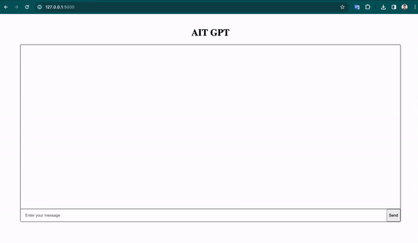

# AIT GPT

Submitted by: Sunil Prajapati (st124073)

### Description

AIT GPT is built to answer anything AIT related! Built on documents about the institution and mdoeled upon FastChat modelm it provides a seamless texting experience with a bot that can answer the question as much it can.

### Dataset
For data about the college, the website and wikipedia were scraped for the content and convert into on big pdf file.

### Repo Strcuture
<pre>
root
|--<a href="https://github.com/scherbatsky-jr/nlp-ait-gpt/blob/main/A7.ipynb">A7.ipyng</a>
|--<a href="https://github.com/scherbatsky-jr/nlp-ait-gpt/blob/main/app">app</a>
    |--<a href="https://github.com/scherbatsky-jr/nlp-ait-gpt/blob/main/app/lib">lib</a>
    |--<a href="https://github.com/scherbatsky-jr/nlp-ait-gpt/blob/main/app/static">static</a>
    |--<a>templates</a>
    |   |--<a href="https://github.com/scherbatsky-jr/nlp-ait-gpt/blob/main/app/templates/index.html">index.html</a>
    |
    |--<a href="https://github.com/scherbatsky-jr/nlp-ait-gpt/blob/main/app/main.py">app.py</a>
</pre>

### Running the app

To run the app, go to the app folder by:

`cd app`

Run the app.py file to start the server

`python3 app.py`

The flask server will start at `http://localhost:5000`

### Demo

